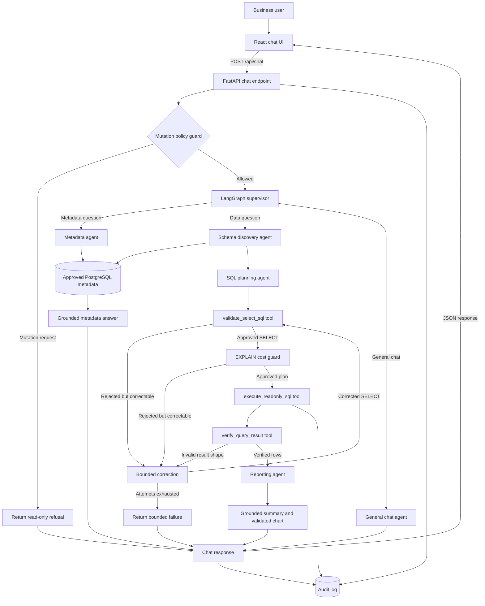

# AskMe Current Architecture

## Architecture status

AskMe is a bounded multi-agent system orchestrated by LangGraph. A supervisor coordinates a metadata agent, schema-discovery agent, SQL agent, correction agent, reporting agent, and general-chat agent. The system uses LangChain tools with explicit contracts; it does not use an unrestricted ReAct loop.

Two specialized AI model roles support those agents. The SQL model proposes SELECT statements; the knowledge model explains approved metadata and summarizes verified results. Deterministic LangGraph tool nodes retain control of schema access, security policy, query checking, database execution, limits, reporting validation, and auditing.

## End-to-end flow

```text
React UI
  -> User selects an approved schema for the conversation
  -> POST /api/chat
  -> FastAPI validation, request ID, and mutation policy guard
  -> LangGraph supervisor routes to metadata, SQL, or chat agents
  -> Schema agent calls the approved-schema discovery tool
  -> SQL agent loads a validated cached plan or proposes one SELECT
  -> Full-catalog recheck for model UNSUPPORTED claims
  -> SQLGlot PostgreSQL AST policy checker
  -> PostgreSQL EXPLAIN cost guard
  -> Bounded correction loop (maximum SQL_MAX_ATTEMPTS)
  -> Read-only PostgreSQL execution
  -> Deterministic result verification
  -> Grounded answer based on returned rows
  -> Deterministic insights and validated AI chart planning
  -> Audit event
  -> React report with answer, chart, table, SQL, and exports
```

## Chat architecture diagram



The model proposes SQL and business language, but it does not control routing,
authorization, cost approval, execution, result verification, reporting validation,
or audit logging. Every retry returns through the same deterministic controls.

## Agent stages

### 1. Intent and policy

The backend routes each request into one of two principal capabilities, plus safety and normal-chat paths:

1. **Metadata explanation:** Answer general questions about the approved database,
   selected schema, tables, columns, types, keys, comments, and declared relationships.
   This route uses metadata only and executes no business-data SQL.
2. **SELECT-only analytics:** Generate, validate, execute, recover, summarize, and
   report a read-only query over authoritative rows.

Mutation requests stop before any model or database call.

### 2. Semantic schema retrieval

The backend validates the requested schema against the `DB_SCHEMAS` allowlist. The schema service maintains a separate authoritative catalog and cache for each approved schema, reads it from `information_schema`, and removes restricted tables and columns. For a data question, the model receives:

1. An inventory of approved table names.
2. Detailed columns and keys for the most relevant tables.
3. Approved foreign-key neighbors needed for likely joins.

Detailed metadata is bounded by `SCHEMA_MAX_TABLES` (default `8`). Retrieval combines exact identifiers, column terms, business synonyms, and approved foreign-key neighbors. Raw sample rows are not used for schema discovery.

### 3. SQL generation

Cloudflare Workers AI receives the runtime rules from `SKILL.md`, approved metadata, relevant conversation context, and the current question. It must propose exactly one PostgreSQL `SELECT`.

Conversation context is deliberately selective:

- A complete standalone question is generated without previous failed turns.
- Clear follow-ups such as “Only show the top 5” receive the latest bounded context.
- Successful SQL plans are persisted in SQLite by selected schema, a SHA-256 hash of the normalized question, and an authoritative schema fingerprint.
- Changes to tables, columns, types, keys, or foreign-key relationships produce a new fingerprint and automatically miss the old plan.
- A reused plan still passes every AST, cost, execution, and result-verification control.

This prevents an unrelated failed request from contaminating a new complete question while preserving useful conversational follow-ups.

### 4. Explicit query checking

Before execution, SQLGlot parses the proposal with the PostgreSQL dialect. The deterministic AST checker enforces:

- One `SELECT` statement only.
- Approved schema and table references.
- Valid aliases and qualified column references.
- Restricted identifier policy.
- No `SELECT *` (`COUNT(*)` is allowed).
- Read-only contents inside CTEs and subqueries.
- A configured maximum join count.
- A hard result limit.

The database service repeats the core read-only protections at execution time.

### 5. Cost guard and bounded recovery

PostgreSQL runs `EXPLAIN (FORMAT JSON)` without `ANALYZE`. The cost guard rejects plans above configured estimated-cost or estimated-row thresholds before business-data execution.

Correctable validation or PostgreSQL errors can trigger a new attempt with expanded approved metadata and error feedback.

- Maximum attempts: `SQL_MAX_ATTEMPTS` (default `3`).
- Repeated rejected SQL stops immediately.
- A model-generated `UNSUPPORTED` claim is not immediately trusted.
- Unsupported claims are retried against the complete approved catalog without conversation history.
- Forbidden requests are never retried.
- Authentication and connectivity failures are not treated as SQL mistakes.
- Every attempt must pass the same deterministic checker.

This is a bounded correction loop, not an autonomous open-ended agent loop.

### 6. Read-only execution

Validated SQL is executed through a Psycopg connection pool using a read-only transaction. The selected approved schema is applied as a transaction-local search path, with connection timeout, statement timeout, and row limit. The AI model never receives database credentials or a direct connection.

### 7. Analysis and reporting

After execution, deterministic result verification checks observable invariants such as count shape, top-N ordering/limits, and chartable result shape. A failed check enters the same bounded correction loop. The model then summarizes only rows returned by PostgreSQL. The reporting service adds deterministic insights. For chart-worthy questions, an AI planner may propose a chart type, title, and axes, but the backend validates every axis against the exact returned columns and permits only real numeric measures. The planner cannot generate chart values. Unsuitable questions, such as schema-variable listings, receive no chart.

An empty result receives one schema-grounded correction attempt. If the corrected SQL is identical or still returns no rows, AskMe treats the result as confirmed empty and explains that no records matched. It does not fabricate a business conclusion or chart values; the report explicitly states why no chart can be generated.

| Result and question shape | Output |
|---|---|
| Date or time series | Line chart |
| Category comparison or ranking | Bar chart |
| Explicit share or distribution with 2-8 non-negative categories | Pie/donut chart |
| Single value or unsuitable result | No chart |

### 8. Audit and response

The backend records the request ID, session, decision, status, SQL when applicable, row count, and elapsed time. The frontend renders the answer, executive insights, chart, result table, formatted copyable SQL, exports, and trace information.

The current UI also provides a collapsible history sidebar, per-conversation schema selection, conversation rename/delete controls, editable user questions, a conversation/schema context header, database connectivity status, responsive mobile navigation, and an active-schema indicator in the composer.

## Main components

| Component | Location | Responsibility |
|---|---|---|
| Chat API | `backend/app/api/routes/chat.py` | Request orchestration and response contract |
| Agent inventory API | `GET /api/agent/info` | Deployed framework, graph nodes, tools, and model roles |
| LangGraph supervisor | `backend/app/agents/graph.py` | Routing, graph construction, bounded transitions, and recovery |
| Agent state | `backend/app/agents/state.py` | Small shared state and stable result contract |
| LangChain tools | `backend/app/agents/tools.py` | Explicit schema, validation, EXPLAIN, execution, and verification interfaces |
| Agent debugging | `backend/app/agents/debug.py` | Opt-in redacted node transition and timing logs |
| LLM role helpers | `backend/app/services/query_agent.py` | Metadata answers, SQL proposals, summaries, and chat prompts |
| Plan cache | `backend/app/services/plan_cache.py` | Persist schema-versioned validated SQL plans |
| Schema service | `backend/app/services/schema.py` | Approved catalog and progressive discovery |
| Query checker | `backend/app/services/query_checker.py` | Pre-execution deterministic validation |
| Cost guard | `backend/app/services/cost_guard.py` | EXPLAIN plan thresholds |
| Result verifier | `backend/app/services/result_verifier.py` | Post-execution invariant checks |
| Database service | `backend/app/services/database.py` | Read-only pool and execution |
| AI client | `backend/app/services/ai.py` | Authenticated Cloudflare Workers AI requests |
| Runtime skill | `backend/app/skills/askme-data-assistant/SKILL.md` | SQL and summary rules |
| Reporting service | `backend/app/services/reporting.py` | Insights, AI chart planning, validation, and fallback |
| Audit service | `backend/app/services/audit.py` | Append-only pilot audit records |
| History service | `backend/app/services/history.py` | Bounded backend context |
| React app | `frontend/src/App.tsx` | Conversation and API state |
| Report renderer | `frontend/src/components/ReportInsights.tsx` | Bar, line, and pie/donut charts |
| Result table | `frontend/src/components/DataTable.tsx` | Rows and exports |
| Sidebar | `frontend/src/components/Sidebar.tsx` | Conversation history and database status |
| Composer | `frontend/src/components/Composer.tsx` | Schema-aware question input |

## Model configuration

Both Cloudflare model roles are independently configurable:

```env
CF_ACCOUNT_ID=your_account_id
CF_API_TOKEN=your_api_token
CF_AI_MODEL=@cf/meta/llama-3.1-8b-instruct-fast
CF_SQL_MODEL=@cf/meta/llama-3.1-8b-instruct-fast
CF_KNOWLEDGE_MODEL=@cf/meta/llama-3.1-8b-instruct-fast
CF_AI_TEMPERATURE=0.1
CF_AI_TIMEOUT_SECONDS=60
```

`CF_AI_MODEL` is the backwards-compatible fallback. The SQL role handles planning and bounded correction. The knowledge role handles grounded metadata explanations, verified-result summaries, database conversation, and chart proposals. Neither role authorizes or executes SQL.

For local troubleshooting, set `AGENT_DEBUG=true`. Every graph node then emits structured start/end timing logs. Raw questions and SQL are hashed, while result rows and credentials are omitted. Keep it disabled when detailed operational tracing is unnecessary.

## Trust boundaries

- Credentials stay in the backend environment.
- Browser schema selections must match the backend `DB_SCHEMAS` allowlist.
- Catalogs, validation, execution search paths, and conversation context are isolated by selected schema.
- Restricted metadata is removed before model inference.
- Schema discovery exposes metadata, not sample data.
- The deterministic checker, not the model, authorizes SQL.
- PostgreSQL role permissions are the primary execution boundary.
- Read-only sessions, limits, and timeouts provide defense in depth.
- Browser `localStorage` history and JSONL audit files are pilot storage mechanisms.
- The plan cache stores SQL and hashed question keys, not raw question text.

## Current limitations and roadmap

Current limitations include an AST policy layer that is not a complete PostgreSQL authorization engine, lightweight synonym-based semantic retrieval rather than a governed vector catalog, in-memory backend conversations, a local SQLite plan cache, local browser history, local audit storage, one active schema per conversation, no SSO/RBAC, no governed business glossary, and no complete golden-query evaluation suite.

The current graph is intentionally bounded rather than an open-ended tool loop. Future work includes durable LangGraph checkpointing, LangSmith-compatible tracing, role-based tool access, and a golden-query evaluation suite. Security decisions remain deterministic and outside model control.
